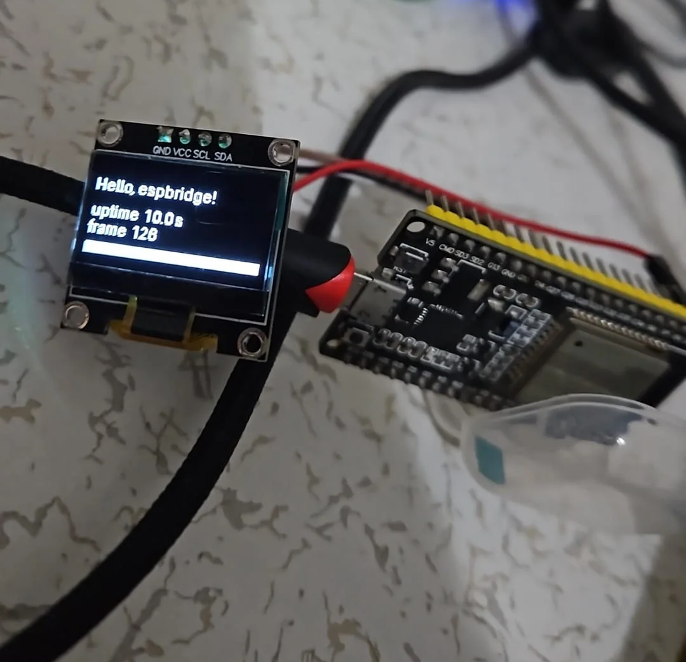

# python-esp-bridge

Connect an ESP32 to a Raspberry Pi (or any PC) over USB **or Bluetooth** and
drive **every** ESP32 peripheral live from Python — GPIO, PWM, ADC, DAC,
capacitive touch, I2C, SPI, extra UARTs, Wi-Fi (including TCP/UDP sockets
through the ESP32 radio) and BLE. Flash the bridge firmware **once**; after
that, everything is Python on the host. No reflashing per project.

```
┌────────────────┐  USB serial (≤921600 Bd) or BLE  ┌─────────────────────┐
│ Pi / PC        │ ───────────────────────────────► │ ESP32 (bridge fw)   │
│ Python:        │   binary protocol, COBS+CRC16    │ FreeRTOS tasks:     │
│  espbridge     │ ◄─────────────────────────────── │  tx / rx / network  │
└────────────────┘        replies + async events    └─────────────────────┘
```



## Quick start

1. **Flash the firmware once** — open [`firmware/firmware.ino`](firmware/) in
   Arduino IDE (esp32 core 3.x, partition scheme *Huge APP*), hit Upload.
   Details: [`firmware/README.md`](firmware/README.md).
2. **Install the Python library** on the Pi/PC:

   ```sh
   pip install python-esp-bridge          # USB only
   pip install "python-esp-bridge[ble]"   # + Bluetooth support
   ```

3. **Go:**

   ```python
   from espbridge import Bridge

   with Bridge() as esp:                      # auto-detects the USB port
       print(esp.info)                        # chip, MAC, capabilities

       esp.gpio.mode(2, "output")             # like RPi GPIO, but on the ESP32
       esp.gpio.write(2, 1)
       print(esp.adc.read_mv(34), "mV")
       esp.dac.write(25, 128)                 # true analog out (classic ESP32)
       esp.pwm.servo(13, angle=90)

       esp.i2c.init(sda=21, scl=22)
       print([hex(a) for a in esp.i2c.scan()])

       esp.wifi.connect("ssid", "password")   # the ESP32's radio...
       status, body = esp.net.http_get("http://example.com/")  # ...as your modem
   ```

   Or with **no USB cable at all** — boards advertise as `espbridge_<mac>`
   (plus your custom name) and require a password (default `espbridge`,
   change it at the top of `firmware.ino`):

   ```python
   with Bridge(ble=True, password="espbridge") as esp:   # over Bluetooth
       esp.gpio.write(2, 1)
   ```

   `espbridge` on the command line prints connection info; `espbridge ports`
   lists candidate serial ports; `espbridge scan` probes every attached board
   and `espbridge scan --ble` finds bridges advertising over Bluetooth.

## Features

| module | highlights |
|--------|------------|
| GPIO   | modes incl. pull-up/down & open-drain, batch writes, edge interrupts with debounce → Python callbacks |
| ADC    | raw + calibrated mV, attenuation config (ADC2/Wi-Fi conflict guarded) |
| DAC    | 8-bit output + hardware cosine generator (classic ESP32 / S2) |
| PWM    | LEDC: any pin, freq/resolution, `duty_pct`, `tone`, `servo` |
| Touch  | capacitive touch pad reads |
| I2C    | 2 buses, scan, write/read, register helpers, repeated-start |
| SPI    | 2 hosts, full-duplex transfers, CS handling |
| UART   | UART1/2 bridged: write from Python, RX streamed back as events |
| Wi-Fi  | scan, STA join, AP mode, status/RSSI, state events |
| NET    | TCP client/server + UDP **through the ESP32 radio**, socket-like API, credit-window flow control |
| BLE    | scan, advertise, GATT server (notify/write callbacks), GATT client |

The firmware is fully event-driven on FreeRTOS: serial TX, command handling
and the network stack run as separate tasks, so a blocking Wi-Fi/BLE
operation never delays a GPIO read (~1 ms round-trips at 921600 Bd).

## Use the libraries you already know

espbridge speaks the wire protocols of the popular Python hardware ecosystems,
so existing code, drivers and tutorials run unchanged — the ESP32's pins just
take the place of the Pi's:

**gpiozero** — full pin factory (LED, Button, PWMLED, edge callbacks, …):

```python
from gpiozero import LED, Button
from espbridge.compat.gpiozero import EspBridgeFactory

factory = EspBridgeFactory(esp)
led, btn = LED(2, pin_factory=factory), Button(4, pin_factory=factory)
btn.when_pressed = led.toggle
```

**Adafruit CircuitPython drivers** (hundreds of sensors/displays) — busio/digitalio-compatible I2C, SPI and DigitalInOut:

```python
from adafruit_bme280.basic import Adafruit_BME280_I2C
from espbridge.compat.blinka import I2C

bme = Adafruit_BME280_I2C(I2C(esp))     # the driver doesn't know it's bridged
print(bme.temperature)
```

**smbus2** — classic Pi I2C code, unchanged:

```python
from espbridge.compat.smbus import SMBus
bus = SMBus(esp)                        # instead of smbus2.SMBus(1)
temp = bus.read_byte_data(0x48, 0x00)
```

**luma.oled / luma.lcd** — I2C and SPI display interfaces (`LumaI2C`, `LumaSPI`),
**RPi.GPIO** — `espbridge.compat.rpi_gpio` shim, and the native objects follow
stdlib conventions too: UART ports are pyserial-like (`in_waiting`, `readline`),
bridged TCP/UDP sockets support `settimeout`/`recv`/`sendall`.

I2C OLEDs (SSD1306 / SH1106 / the ubiquitous clones) are supported directly —
`pip install "python-esp-bridge[oled]"`, draw with PIL:

```python
from espbridge.oled import OLED

oled = OLED(esp)                # bus init + auto-detect + clone-safe power-up
with oled.draw() as d:          # d is a PIL ImageDraw
    d.text((0, 10), "Hello!", fill="white")
```

### Multiple ESP32s

Give each board a persistent name once (`espbridge -p COM7 set-name relays` —
stored in the ESP32's flash, survives reboots and port renumbering), then:

```python
import espbridge
from espbridge import Bridge

esp = Bridge(name="relays")                  # or Bridge(mac="aa:bb:cc:dd:ee:ff")

with espbridge.connect_all() as boards:    # or just open all of them
    boards.by_name("sensors").adc.read(34)
    boards.by_name("relays").gpio.write(2, 1)
```

## Repo layout

| path | what |
|------|------|
| [`firmware/`](firmware/) | Arduino firmware (flash once; Bluetooth password lives at the top of `firmware.ino`) |
| [`src/`](src/) | Python package `python-esp-bridge` (import `espbridge`; transports: USB serial + BLE) |
| [`examples/`](examples/) | grouped: `basics/`, `wireless/`, `network/`, `displays/`, `compat/` (gpiozero, adafruit, luma, smbus, rpi_gpio) |
| [`tests/`](tests/) | hardware-free protocol/bridge tests (`pytest tests/`) |
| [`docs/PROTOCOL.md`](docs/PROTOCOL.md) | binary wire protocol spec (framing, transports, auth) |

## Supported hardware

Primary target: classic **ESP32** DevKits (ESP-32S / ESP-32D, 30- and 38-pin,
CP2102/CH340 USB). **ESP32-S3** builds via the same sketch (native USB; no DAC,
BLE-only). Capabilities are reported by the firmware at connect time, so the
Python API fails fast with a clear error for anything your chip lacks.
